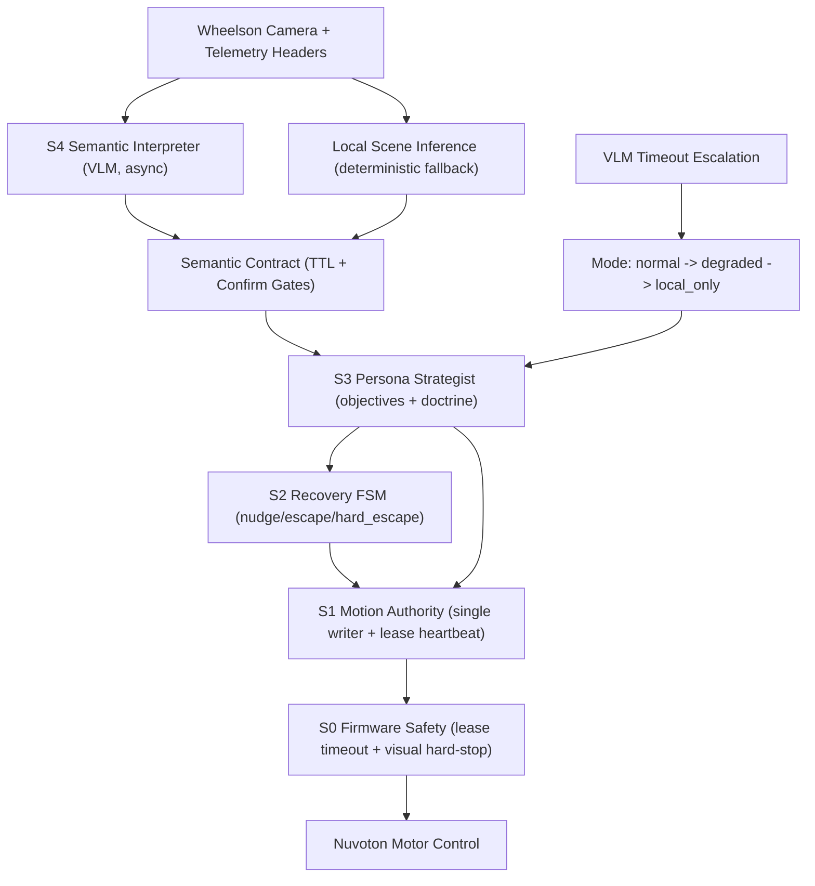

# Wheelson Explorer

Autonomous exploration stack for CircuitMess Wheelson using a **subsumption-type architecture**:
- firmware safety/reflexes,
- deterministic local planning,
- async VLM scene semantics,
- persona-specific strategy.

The system is designed so robot motion remains safe and deterministic even when VLM calls are slow or unavailable.

## Architecture (Subsumption-Type)

Control is layered by priority. Higher-priority layers can suppress lower-priority intent.

1. **S0 Firmware Safety (hard realtime-ish)**
- Lease timeout stop (`lease_timeout` latch)
- Visual obstacle hard-stop (`visual_obstacle` latch)
- Exposes camera + telemetry headers + active command metadata

2. **S1 Motion Authority (middleware)**
- Single writer to `/move` (`MotionSupervisor`)
- Heartbeat renewal for continuous motion commands
- Command metadata propagation (`command_id`, `source`, `mode`)

3. **S2 Recovery FSM (middleware)**
- Deterministic nudge/escape/hard-escape escalation
- Motion-score based no-progress recovery

4. **S3 Persona Strategist (middleware)**
- Persona-specific motion doctrine and objectives
- Distinct policies for `benson`, `sir_david`, `klaus`, `zog7`

5. **S4 Semantic Interpreter (VLM, async advisory)**
- VLM outputs **scene semantics only** (`frontier`, `traversability`, `novelty`, `hazard`, `headlight`, `observation`)
- No direct motor commands from VLM

### Control/Dataflow Diagram



## VLM Safety Contract

The VLM is intentionally non-blocking and non-authoritative for motion.

- **Async only**: planner continues without waiting for VLM completion.
- **Semantic TTL**: stale VLM semantics expire (`SEMANTIC_TTL_SEC`).
- **Confirmation gates**: risky one-frame labels (`hard`, `blocked`) require confirmation across frames.
- **Timeout escalation**:
  - stage 1: timeout fallback (pause + scan behavior)
  - stage 2: degraded mode
  - stage 3: temporary `local_only` lockout (`STRATEGY_LOCAL_ONLY_SEC`)
- **Modes**:
  - `normal`
  - `degraded`
  - `local_only`

## Personas (Distinct Strategy Layer)

Each persona has distinct:
- movement doctrine,
- objective style,
- commentary style,
- degraded/timeout behavior.

| Persona | Movement Signature | Primary Objective Style |
|---|---|---|
| `benson` | conservative, safety pauses, risk-first reroutes | compliance/safety sweep |
| `sir_david` | curiosity arcs, novelty-biased approach/reframe | documentary exploration |
| `klaus` | perimeter acquisition + wide signature arcs | spatial-flow/perimeter audit |
| `zog7` | edge-cover seeking, concealment pauses, tactical resets | covert mapping / exposure minimization |

## Repository Structure

```text
wheelson-explorer/
├── firmware/
│   └── wheelson_explorer/
│       └── wheelson_explorer.ino
├── middleware/
│   ├── main.py
│   ├── dashboard.html
│   ├── requirements.txt
│   └── .env.example
└── README.md
```

## Hardware Notes

- CircuitMess Wheelson (ESP32)
- 2.4 GHz Wi-Fi
- Camera is primary perception channel

### Ultrasonic Status

The current stack treats ultrasonic as unavailable in runtime planning/safety.
- Middleware distance is treated as `999.0cm` placeholder.
- Firmware safety uses **visual obstacle telemetry** and lease safety.

## Firmware

File: `firmware/wheelson_explorer/wheelson_explorer.ino`

### Arduino Setup

- Board: `ESP32 Dev Module`
- Partition: `Huge APP (3MB No OTA/1MB SPIFFS)`
- PSRAM: `Enabled`
- Upload speed: `115200` if high-speed uploads fail

Set Wi-Fi credentials in the sketch:

```cpp
#define WIFI_SSID "WIFI_SSID"
#define WIFI_PASSWORD "WIFI_PASSWORD"
```

### Firmware API

#### `GET /camera`
Returns JPEG bytes plus telemetry headers:

- `X-Distance-CM`
- `X-Raw-Pulse-US`
- `X-Visual-Obstacle`
- `X-Obstacle-Left-Ratio`
- `X-Obstacle-Right-Ratio`
- `X-Nav-State`
- `X-Brightness`
- `X-Dominant-Color`
- `X-Active-Command-Id`
- `X-Active-Command-Source`
- `X-Active-Command-Mode`
- `X-Safety-Latched`
- `X-Safety-Reason`

#### `GET /status`
Returns state JSON including:

- `distance_cm`, `ip`
- `nav_state`
- `command_id`, `source`, `mode`
- `safety_latched`, `safety_reason`

#### `POST /move`
Supports command metadata:

- `command_id`
- `source`
- `mode`

Supported payload forms:

```json
{ "command": "set_speed", "level": "slow|medium|fast", "command_id": "...", "source": "...", "mode": "..." }
```

```json
{ "command": "set_light", "level": "0..255", "command_id": "...", "source": "...", "mode": "..." }
```

```json
{ "command": "move_indefinitely", "direction": "forward|backward|left|right|stop", "command_id": "...", "source": "...", "mode": "..." }
```

```json
{ "action": "forward|backward|left|right|stop", "duration_ms": 500, "command_id": "...", "source": "...", "mode": "..." }
```

## Middleware

File: `middleware/main.py`

### Install

```bash
cd middleware
python -m venv .venv
source .venv/bin/activate
pip install -r requirements.txt
cp .env.example .env
```

### Core Environment Variables

```env
WHEELSON_IP=192.168.1.112
GEMINI_API_KEY=...
LOOP_INTERVAL_SEC=4.0
PORT=8000
OLLAMA_BASE_URL=http://localhost:11434
```

### Important Optional Controls

```env
# VLM timing
OLLAMA_STRATEGY_MIN_INTERVAL_SEC=8.0
OLLAMA_VLM_TIMEOUT_SEC=14.0
OLLAMA_TIMEOUT_BACKOFF_SEC=24.0

# Semantic contract
SEMANTIC_TTL_SEC=18.0
SEMANTIC_HARD_CONFIRM_FRAMES=2
SEMANTIC_BLOCKED_CONFIRM_FRAMES=2

# Timeout escalation
STRATEGY_TIMEOUT_WINDOW_SEC=90.0
STRATEGY_TIMEOUT_STAGE2_COUNT=2
STRATEGY_TIMEOUT_STAGE3_COUNT=3
STRATEGY_LOCAL_ONLY_SEC=60.0

# Persona strategy tuning
FORWARD_BURST_DEFAULT_MS=850
KLAUS_ARC_INTERVAL=3
KLAUS_ARC_TURN_MS=760
TIMEOUT_SCAN_STEPS=2
TIMEOUT_SCAN_TURN_MS=700
```

### Run

```bash
# Gemini
python main.py --provider gemini --personality benson

# Ollama
python main.py --provider ollama --model llava --personality klaus
```

CLI:

```text
python main.py [--provider gemini|ollama] [--model MODEL] [--personality NAME] [--port PORT]
```

## Runtime Telemetry / Health

### Dashboard

Default: [http://localhost:8000](http://localhost:8000)

### `GET /health` (middleware)

Includes high-value runtime state:

- `strategy_source`
- `strategy_mode`
- `strategy_degraded_level`
- `strategy_age_sec`
- `semantic_confidence`
- `semantic_pending_hard`
- `semantic_pending_blocked`
- `vlm_timeout_count`
- `vlm_disabled_remaining_sec`
- scene fields (`scene_frontier`, `scene_traversability`, `scene_novelty`, `scene_hazard`)
- command authority fields (`command_id`, `command_source`, `command_mode`)

## How Persona Interacts with VLM Now

- VLM does **not** roleplay personas and does **not** emit actions.
- Persona is applied in two safe ways:
  1. **Salience hints** to VLM prompt (what to notice in scene interpretation).
  2. **Local strategist doctrine** for movement/objectives/commentary.

This preserves deterministic control while still allowing persona-specific behavior.

## Known Operational Guidance

- If Ollama is slow or timing out, robot continues in local mode with staged degradation.
- `nav=HOLD` is expected when using timed motion pulses (`duration_ms > 0`).
- Prefer local vision telemetry and motion consistency metrics over ultrasonic.

## License

MIT
